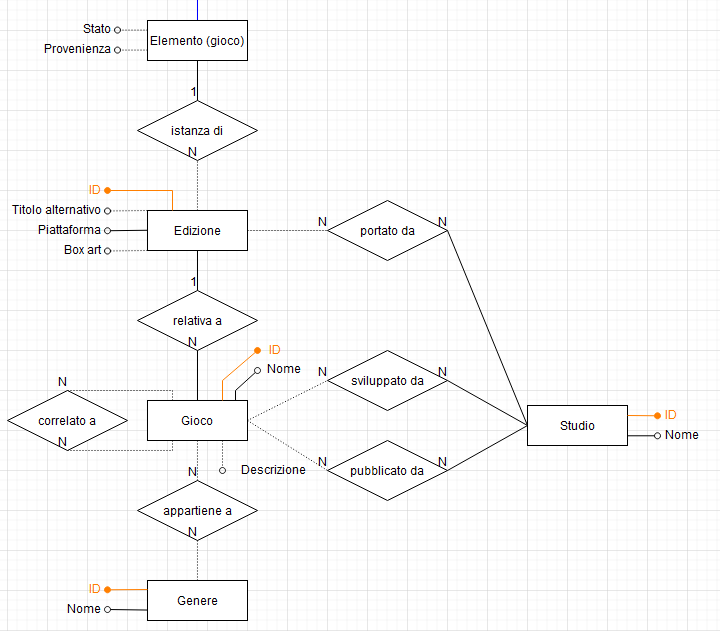

# Relazioni e attributi

## Legenda

- Rettangolo: **entità**
- Rombo: **relazione**
- Linea continua: **attributo obbligatorio** / **relazione 1 a X**
- Linea tratteggiata: **attributo facoltativo** / **relazione 0 a X**
- Pallino o linea arancione: (parte della) **chiave primaria**

## Utenti

> Chiunque può registrarsi al sito web scegliendo un username univoco e inserendo una password segreta (sarà [hashata](https://it.wikipedia.org/wiki/Funzione_di_hash) con l'algoritmo [bcrypt](https://it.wikipedia.org/wiki/Bcrypt) prima che venga inserita nel database), creando così un utente.
>
> Esisterà una tipologia particolare di utente: l'utente **amministratore**.
> 
> Inoltre, potranno decidere di __bannare__ utenti dal sito, impedendo loro di effettuare l'accesso e di conseguenza di interagire con la loro raccolta.

Per gli Utenti, si sono aggiunti gli attributi all'entità seguendo strettamente le specifiche. 

## Elementi

> Gli utenti potranno aggiungere _elementi_ alla loro raccolta multimediale.
>
> Un elemento rappresenta una copia di un libro, di un film o di un videogioco posseduta da un utente.
>
> Ogni elemento avrà associato uno **stato** da una lista di opzioni diversa per ogni tipologia: [...]
>
> Inoltre, ogni elemento avrà associata una **provenienza** da un'altra lista: [...]

> Un utente potrà lasciare una recensione ad ogni elemento presente nella sua raccolta.
>
> La recensione sarà composta da una valutazione (tra 0 e 100, dove 100 è la valutazione migliore), un commento e la data di pubblicazione.

Gli Elementi sono stati suddivisi in tre sottoentità _Elemento (Libro)_, _Elemento (film)_ ed _Elemento (gioco)_ per permettere loro di possedere attributi e relazioni di tipo diverso gli uni dagli altri.

Le Recensioni presentano un caso di **chiave primaria esterna**: esse infatti usano come chiave primaria l'id dell'elemento a cui si riferiscono. 

## Libri

> Ogni libro avrà una sua pagina in cui sarà presente il titolo originale, gli autori, i generi, un breve riassunto della trama, l'elenco di tutte le sue edizioni (sia in formato libro sia in formato audiolibro) e opzionalmente una lista di opere correlate (sequel, prequel, libri ambientati nello stesso universo, etc).
> 
> Ciascuna edizione del libro avrà una seconda pagina con ulteriori informazioni, quali il suo titolo, la copertina, la casa editrice e il numero di pagine; ciascuna edizione sarà identificata da il relativo [codice ISBN](https://it.wikipedia.org/wiki/ISBN).
> 
> Le edizioni in formato audiolibro avranno attributi diversi: invece che avere il numero di pagine e la copertina, essi avranno la durata in minuti e secondi della registrazione e opzionalmente un'immagine che rappresenti l'audiolibro.

Lo schema dei libri è stato realizzato seguendo in buona parte le specifiche; si sono però realizzate alcune aggiunte:
- Gli Editori sono identificati dal loro prefisso ISBN;
- Le Edizioni di un libro sono dotate anch'esse di un titolo, che rappresenta il titolo dell'Edizione specifica (titolo tradotto, edizione speciale...);
- [Come menzionato in precedenza](3-2-gerarchie.md), è stata realizzata una gerarchia IsA con le Edizioni di Libri e Audiolibri;
- Le Edizioni di un Audiolibro possono avere associato uno o più Narratori.

Si è scelto di usare l'ID interno come chiave delle entità Narratore, Autore e Genere in modo da permettere la modifica del rispettivo nome senza dover andare a modificare tutte le entità ad esso assicate.

## Film

> Ogni film avrà una sua pagina in cui sarà presente il titolo originale, i titoli nelle varie lingue (identificati dal [codice ISO 639 della lingua](https://en.wikipedia.org/wiki/List_of_ISO_639-1_codes)), una sinossi della trama, la durata, la casa produttrice, il cast, e, come per i libri, una lista opzionale di pellicole correlate.
> 
> I film saranno identificati dal loro [codice EIDR](https://ui.eidr.org/search), e per ciascuno di essi verrà calcolata la valutazione media dalle recensioni, che sarà visualizzata sulla pagina assieme a un campione di recensioni.

## Videogiochi

> Ogni videogioco avrà una sua pagina in cui sarà presente il titolo, lo sviluppatore, il publisher, una breve descrizione del gioco, l'elenco di tutte le piattaforme in cui esso è disponibile e, come per libri e film, un elenco di altri giochi correlati.
> 
> Per ogni piattaforma sarà disponibile una sottopagina, che conterrà la [box art](https://vgboxart.com/) di quella versione, il nome dello studio che ha effettuato il [porting](https://en.wikipedia.org/wiki/Porting#Porting_of_video_games) ed eventualmente il titolo [se diverso da quello principale](https://it.wikipedia.org/wiki/Payday_2#Crimewave_Edition). 

