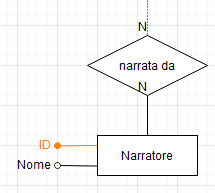
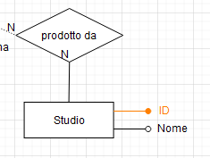
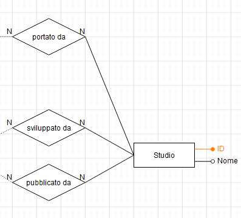
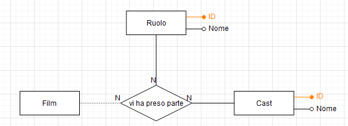

# Relazioni e attributi

## Legenda

- Rettangolo: **entità**
- Rombo: **relazione**
- Linea continua: **attributo obbligatorio** / **relazione 1 a X**
- Linea tratteggiata: **attributo facoltativo** / **relazione 0 a X**
- Pallino o linea arancione: (parte della) **chiave primaria**

## Utenti

> Chiunque può registrarsi al sito web scegliendo un username univoco e inserendo una password segreta (sarà [hashata](https://it.wikipedia.org/wiki/Funzione_di_hash) con l'algoritmo [bcrypt](https://it.wikipedia.org/wiki/Bcrypt) prima che venga inserita nel database), creando così un utente.
>
> Esisterà una tipologia particolare di utente: l'utente **amministratore**.
> 
> Inoltre, potranno decidere di __bannare__ utenti dal sito, impedendo loro di effettuare l'accesso e di conseguenza di interagire con la loro raccolta.

Per gli Utenti, si sono aggiunti gli attributi all'entità seguendo strettamente le specifiche. 

## Elementi

> Gli utenti potranno aggiungere _elementi_ alla loro raccolta multimediale.
>
> Un elemento rappresenta una copia di un libro, di un film o di un videogioco posseduta da un utente.
>
> Ogni elemento avrà associato uno **stato** da una lista di opzioni diversa per ogni tipologia: [...]
>
> Inoltre, ogni elemento avrà associata una **provenienza** da un'altra lista: [...]

> Un utente potrà lasciare una recensione ad ogni elemento presente nella sua raccolta.
>
> La recensione sarà composta da una valutazione (tra 0 e 100, dove 100 è la valutazione migliore), un commento e la data di pubblicazione.

Gli Elementi sono stati suddivisi in tre sottoentità _Elemento (Libro)_, _Elemento (film)_ ed _Elemento (gioco)_ per permettere loro di possedere attributi e relazioni di tipo diverso gli uni dagli altri.

Le Recensioni presentano un caso di **chiave primaria esterna**: esse infatti usano come chiave primaria l'id dell'elemento a cui si riferiscono. 

## Libri

> Ogni libro avrà una sua pagina in cui sarà presente il titolo originale, gli autori, i generi, un breve riassunto della trama, l'elenco di tutte le sue edizioni (sia in formato libro sia in formato audiolibro) e opzionalmente una lista di opere correlate (sequel, prequel, libri ambientati nello stesso universo, etc).
> 
> Ciascuna edizione del libro avrà una seconda pagina con ulteriori informazioni, quali il suo titolo, la copertina, la casa editrice e il numero di pagine; ciascuna edizione sarà identificata da il relativo [codice ISBN](https://it.wikipedia.org/wiki/ISBN).
> 
> Le edizioni in formato audiolibro avranno attributi diversi: invece che avere il numero di pagine e la copertina, essi avranno la durata in minuti e secondi della registrazione e opzionalmente un'immagine che rappresenti l'audiolibro.

Lo schema dei Libri è stato realizzato seguendo in buona parte le specifiche; si sono però realizzate alcune aggiunte:
- Le Edizioni di un libro sono dotate anch'esse di un titolo, che rappresenta il titolo dell'Edizione specifica (titolo tradotto, edizione speciale...);
- [Come menzionato in precedenza](3-2-gerarchie.md), è stata istituita una **gerarchia IsA** con le Edizioni di Libri e Audiolibri;
- Le Edizioni di un Audiolibro possono avere associato uno o più Narratori.

### Una ricorrenza nelle relazioni: il pattern "1NN0"

<!--Il nome gliel'ho dato io, dici che può andare bene?-->

 

Osservando lo schema, si nota che le relazioni "narrata da", "scritto da" e "appartiene a" sono molto simili tra loro: tutte e tre sono **0 a N** nel lato che si collega al Libro (o a una sua Edizione), sono **1 a N** dall'altro lato e si ricollegano a una entità con due soli attributi, _Nome_ e _ID_.

Si è deciso di usare l'associazione **0 a N** nel lato del Libro perchè gli utenti possano non compilare tutti i dettagli di un libro nel momento in cui lo aggiungono ma anche perchè possano compilare accuratamente tutti i campi, ad esempio permettendo l'inserimento di un testo in più generi.

Dato che si è voluto rendere possibili query come "quali libri ha scritto questo autore" o "quali libri appartengono a questo genere" e che inserire nel database autori, narratori o generi a cui non appartiene nessun libro non avrebbe alcun senso, si è scelto di usare una relazione **1 a N** nell'altro lato della relazione.

Infine, per l'entità connessa al lato _1 a N_ della relazione, si è deciso di usare un **ID interno** come chiave dell'entità, in modo da permettere la modifica del _Nome_ associato senza dover andare a modificare tutti i Libri (o Edizioni).

### Editori e ISBN

Tutti i codici ISBN contengono al loro interno [un codice univoco che identifica l'editore](https://it.wikipedia.org/wiki/ISBN#Editore) di un libro; si è quindi deciso di usare questo codice per identificare l'entità Editore, in quanto esso soddisfa tutti i requisiti per essere una chiave.

## Film

> Ogni film avrà una sua pagina in cui sarà presente il titolo originale, i titoli nelle varie lingue (identificati dal [codice ISO 639 della lingua](https://en.wikipedia.org/wiki/List_of_ISO_639-1_codes)), una sinossi della trama, la durata, la casa produttrice, il cast, e, come per i libri, una lista opzionale di pellicole correlate.
> 
> I film saranno identificati dal loro [codice EIDR](https://ui.eidr.org/search), e per ciascuno di essi verrà calcolata la valutazione media dalle recensioni, che sarà visualizzata sulla pagina assieme a un campione di recensioni.

### Il pattern 1NN0 nei film

 

Nello schema dei film, si possono notare altre due applicazioni del pattern _1NN0_ menzionato in precedenza: "prodotto da" e "appartiene a".

### Vi ha preso parte: una relazione 1NN0 ternaria

Nello schema dei film è presente la relazione ternaria "vi ha preso parte".  
Essa associa una persona a un film, specificando il ruolo ("attore", "regista", "sceneggiatore"...) per cui ella vi ha preso parte. 

È stata modellata così in modo da permettere query avanzate sul cast di un film: ad esempio, "in quali film Quentin Tarantino ha avuto il ruolo di regista", oppure "che ruoli ha ricoperto Johnny Depp".

### Localizzazione: una entità debole

Simile al pattern _1NN0_, ma fondamentalmente diversa è la relazione "in altre lingue": essa infatti ha un'associazione _0 a N_ dal lato Film, ma una _1 a 1_ dal lato Localizzazione, e in più, l'associazione è parte della chiave primaria di Localizzazione.

L'entità Localizzazione rappresenta il titolo di un film tradotto in una lingua diversa dall'originale: ad esempio, _Il Padrino_ potrebbe essere una localizzazione in `it` (italiano) di _The Godfather_.  
La sua chiave è composta dal codice della lingua e dall'identificatore del film a cui essa si riferisce: è dunque una **entità debole**.

## Videogiochi

> Ogni videogioco avrà una sua pagina in cui sarà presente il titolo, lo sviluppatore, il publisher, una breve descrizione del gioco, l'elenco di tutte le piattaforme in cui esso è disponibile e, come per libri e film, un elenco di altri giochi correlati.
> 
> Per ogni piattaforma sarà disponibile una sottopagina, che conterrà la [box art](https://vgboxart.com/) di quella versione, il nome dello studio che ha effettuato il [porting](https://en.wikipedia.org/wiki/Porting#Porting_of_video_games) ed eventualmente il titolo [se diverso da quello principale](https://it.wikipedia.org/wiki/Payday_2#Crimewave_Edition). 

<!--TODO-->

