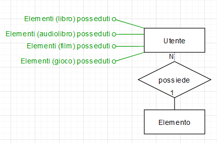

# Dati derivati

In Alexandria non sono presenti molti dati quantitativi: la maggior parte degli attributi sono infatti qualitativi, e come tali meglio descritti da stringhe.

Si è considerata la possibilità di inserire nella base di dati un attributo contenente il **conteggio** di `Elementi` posseduti da un utente.
 

 
Si riportano sotto tutti i calcoli effettuati per decidere se aggiungere o no il dato derivato.
 
## Tabella dei volumi

Secondo una stima effettuata, l'utente medio di Alexandria leggerà all'anno 18 libri, ascolterà 6 audiolibri, guarderà 52 film e giocherà a 24 giochi, per un totale di circa 100 `Elementi` per `Utente` all'anno.

Si ottiene, dunque, la seguente tabella dei volumi:

| Concetto | Tipo | Volume |
|----------|------|--------|
| `Utente` | Entità | **1**/utente |
| `Elemento (audiolibri)` | Entità | **6**/utente/anno |
| `Elemento (libro)` | Entità | **18**/utente/anno |
| `Elemento (film)` | Entità | **52**/utente/anno |
| `Elemento (gioco)` | Entità | **24**/utente/anno |

Si considera solo la categoria degli audiolibri: se per essi è conveniente mantenere il dato derivato, allora lo sarà anche per tutti gli altri tipi di elemento, in quanto hanno volumi maggiori.

## Tabella delle operazioni

Si stima che ogni utente riceverà circa 500 visite alla suo profilo all'anno.

Si sono valutate due diverse operazioni:

| Operazione | Descrizione | Tipo | Frequenza | Schema |
|------------|-------------|------|-----------|--------|
| __OP1__ | Creazione di un nuovo `Elemento (audiolibro)` | Interattiva | **6**/utente/anno | `Elemento (audiolibro)` |
| __OP2__ | Visualizzazione del conteggio di `Elementi` di qualsiasi tipo creati da un `Utente` specifico | Interattiva | **500**/utente/anno | `Elemento (audiolibro)` |

## Tabella dei costi

Si sono utilizzati i seguenti costi per realizzare la tabella dei costi:
- **read**: costo **1**
- **write**: costo **2**
- **update**: composta da 1 read e 1 write, costo **3**

### Senza dato derivato

| Operazione | Procedura | Costi | Costo totale |
|------------|-----------|-------|--------------|
| __OP1__ | Si inserisce una nuova tupla nella tabella `Elemento (audiolibro)`. | 1 write | **2** |
| __OP2__ | Si interroga la tabella `Elemento (audiolibro)`, filtrando le tuple che non sono state create dall'utente desiderato, e si contano le tuple restituite. | 6 read | **6** |

### Con dato derivato

| Operazione | Procedura | Costi | Costo totale |
|------------|-----------|-------|--------------|
| __OP1__ | Si inserisce una nuova tupla nella tabella `Elemento (audiolibro)` e si aggiorna il dato derivato della tupla dell'`Utente` creatore. | 1 write + 1 update | **5** |
| __OP2__ | Si va a vedere il dato derivato nella tabella dell'`Utente` desiderato. | 1 read | **1** |

## Risultato

| Metodo | Costo __OP1__ | Costo __OP2__ | Costo totale |
|--------|---------------|---------------|--------------|
| Senza dato derivato | 2 * 100 | 6 * 500 | 3200 |
| Con dato derivato | 5 * 100 | 1 * 500 | 1000 |

Dato che 1000 < 3200, conviene **creare il dato derivato** nella tabella `Utente`.

La stessa cosa vale per gli `Elementi` di libri, film e giochi: avendo volumi maggiori, essi possono solo aumentare il costo dell'__OP2__ _senza dato derivato_.
